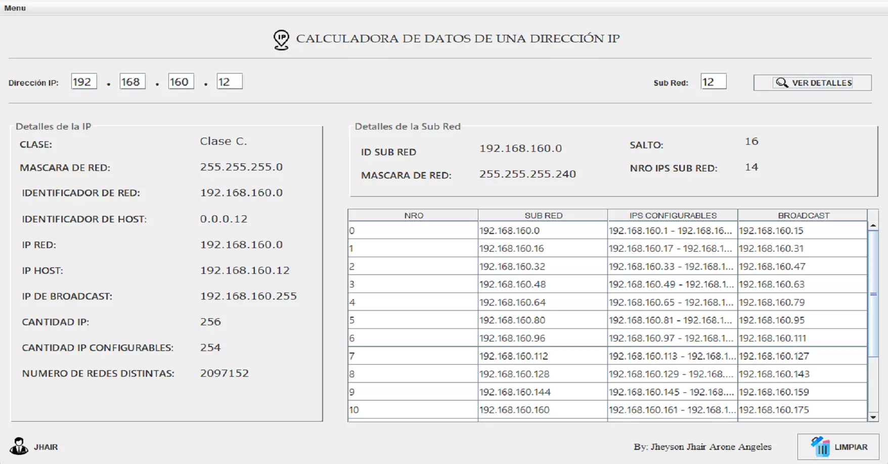

<div align="center">
    <a href="https://github.com/JheysonJhair/ip_calculator.git">
      
    </a>
    <h1>JhairDev - Calculadora IP</h1>
    <p align="center">
        Full Stack Developer Jhair
    </p>
</div>



# Calculadora de IP

Bienvenido a la **Calculadora de IP**, una aplicación que facilita el cálculo de direcciones IP, máscaras de subred y otros parámetros relacionados con redes. Esta herramienta permite realizar cálculos de red de manera rápida y precisa.

## Tecnologías Utilizadas

- **Java**: El lenguaje principal utilizado para implementar la lógica de la aplicación.

---

## Instalación

1. **Requisitos previos**:
   - Tener instalado **Java JDK 17** o superior.

2. **Clonar el repositorio**:
   ```bash
   git clone https://github.com/usuario/ip_calculator.git
   cd ip_calculator
